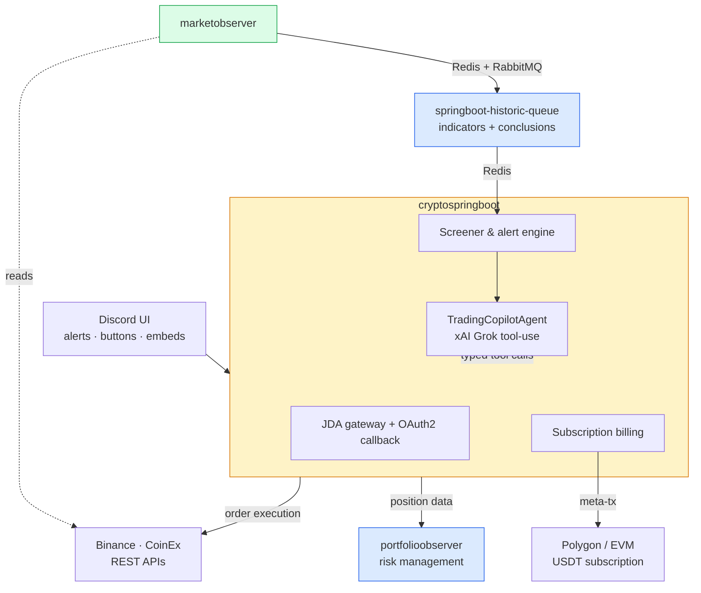
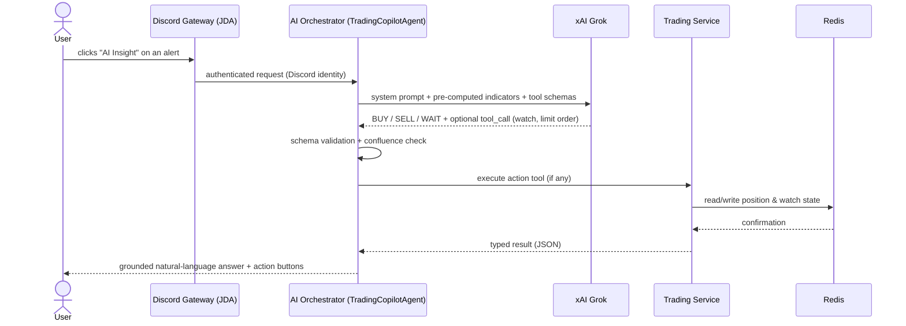
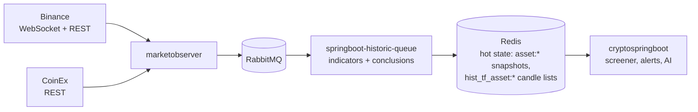
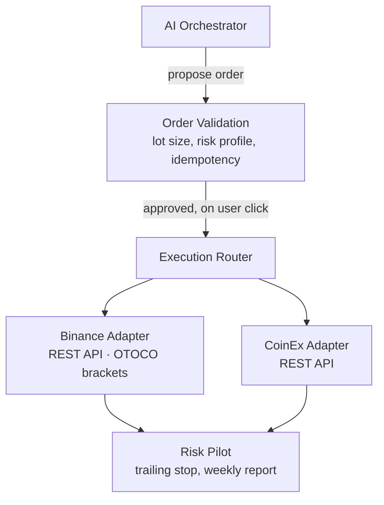

# TradePilot — Technical Architecture

> Companion to the [README](README.md). All diagrams and samples here are **illustrative**: they show the patterns used in production without exposing proprietary logic.

## 0. Component overview

Four decoupled services, no HTTP calls between them — coordination happens exclusively through Redis and MongoDB. `cryptospringboot` is the only service users interact with directly; it owns the Discord gateway, the AI orchestration, the screener/alert logic, and subscription billing.

## 1. Grounded tool-use flow (the core pattern)

The assistant never answers market questions from model memory. Every factual claim is grounded in a tool call executed and validated by the platform:

Design decisions worth noting:

- **Typed tools, not free text.** Every tool has a JSON Schema contract; malformed or out-of-scope calls are rejected before touching any service.
- **Pre-computed context, not raw numbers.** The model receives a Java-computed summary (regime, divergence, %B, timeframe alignment) ahead of the raw candle table — it is not asked to infer temporal patterns from a snapshot.
- **WAIT is a valid tool outcome.** The confluence rule (3+ independent signals for any directional call) is enforced at the prompt level, not left to model discretion.

## 2. Event-driven market data flow

- Ingestion is decoupled from serving: a burst on one exchange never blocks alert evaluation or AI responses.
- **Indicator state is bootstrapped from REST history on cold start** — a service restart never publishes non-converged (mathematically invalid) indicator values. This was the root cause fix behind the incident described in the README.
- Hot reads come exclusively from Redis — sub-millisecond, always the latest normalized snapshot.

## 3. Execution path (multi-exchange behind one abstraction)

- The LLM **proposes**; the platform **disposes**. No order reaches an adapter without the user's click on a Discord button.
- Orders ship as OTOCO brackets on Binance: entry + take-profit + stop-loss in one atomic call, sized from the asset's ATR and the user's risk profile. CoinEx has no OTOCO equivalent — falls back to a plain limit order.
- Once filled, the Risk Pilot takes over: stop-loss where none exists, automatic trailing stop as price runs in the user's favor.
- A separate billing service settles Intermediate/Premium subscriptions in USDT on Polygon (EVM) — Web3 as payments infrastructure, isolated from the trading path. Discord authorization links the user's ID to their wallet before the smart-contract subscription is signed.

## 4. Sanitized samples

See [`samples/`](samples/) for real, sanitized extracts covering exchange abstraction, incremental indicator state, Redis event handling, Discord interaction routing, OAuth identity capture, and the on-chain subscription contract.

---

*These documents describe architecture patterns only. Production code, trading strategies, prompts, and model configurations are proprietary.*
