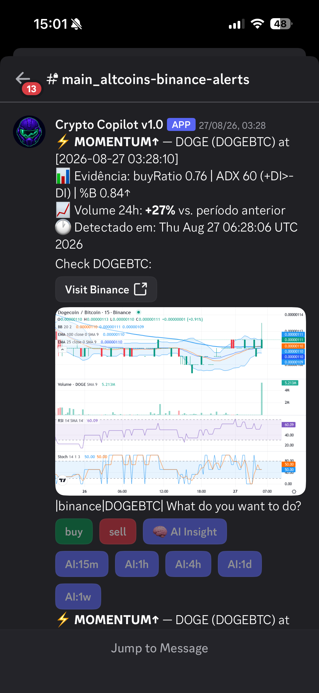
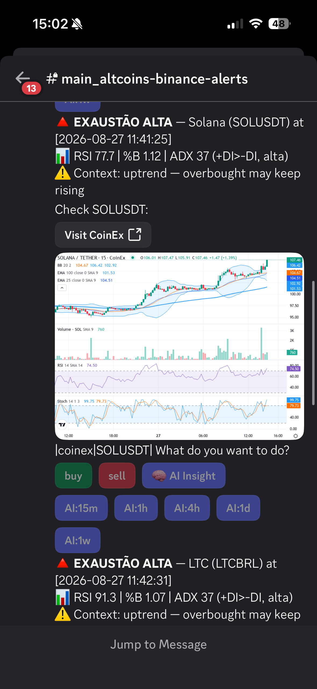
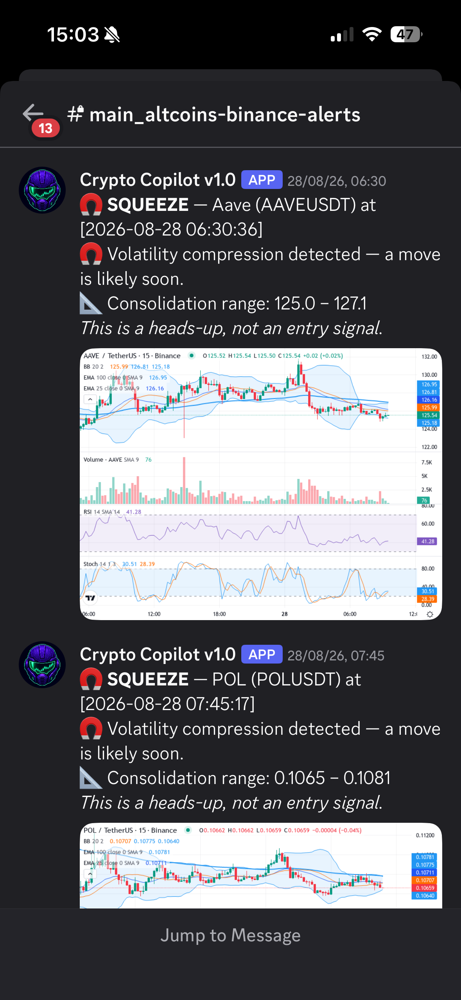
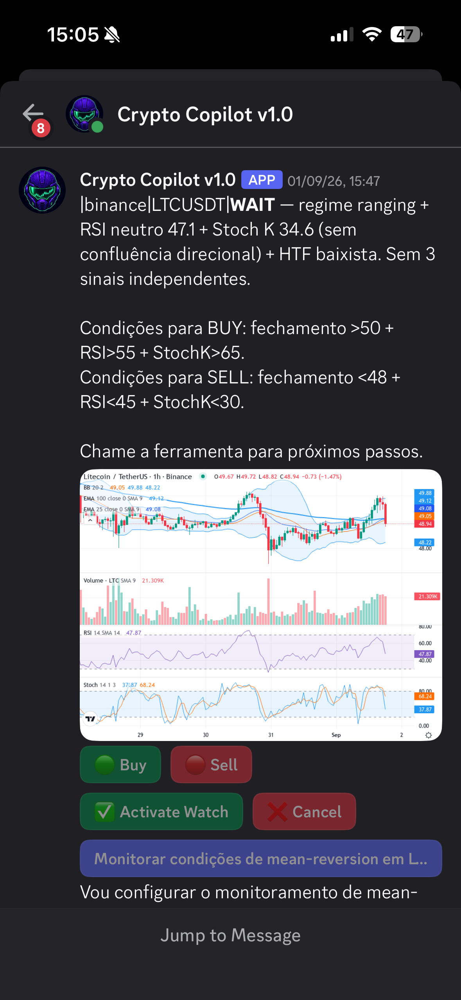
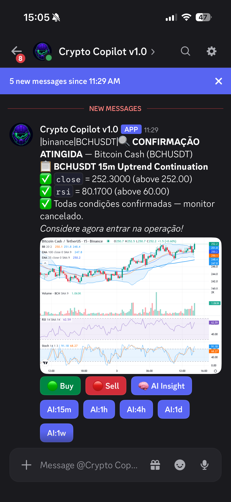
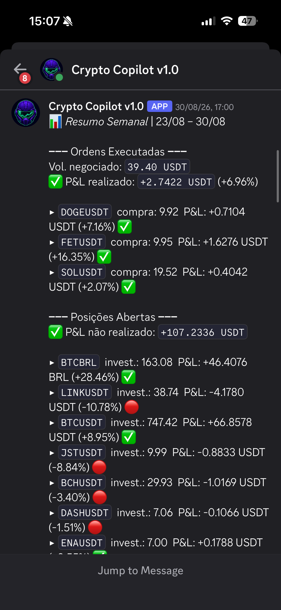

# TradePilot — Screener, AI Co-pilot & Risk Manager for Crypto

> *A screener, a co-pilot and a risk manager — inside Discord. Binance & CoinEx. You see it. You click. You decide.*

> 🔒 **The source code is proprietary and not publicly available.** This repository documents the architecture and engineering decisions at a high level, for professional portfolio purposes. Live product: [tradepilotjl.tech](https://tradepilotjl.tech)

---

## What it does

TradePilot reads over 2,500 tradable pairs on Binance and CoinEx every minute, filters for liquidity, and applies real-time technical analysis to surface trading opportunities — before impulse does. Built and maintained solo: the exchange abstraction, the event-driven pipeline, the indicator engine, the AI orchestration layer, and the on-chain billing integration were all designed and implemented from scratch, end to end.

Three alert classes, each answering a different question:

- **MOMENTUM ↑/↓** — a volume spike **with confirmed direction** (buy ratio, ADX/DI, %B). Directionless spikes don't alert.
- **EXHAUSTION** — a price extreme, plus what it means in the current regime: ranging market → the extreme likely mean-reverts; trending market → it may simply continue.
- **SQUEEZE** — volatility compression (Bollinger Bands tightening) detected *before* the move, with the consolidation range. A heads-up, not an entry signal.

On any alert, **AI Insight** hands the pre-computed indicators to an LLM (xAI Grok) and returns BUY, SELL, or **WAIT** — in the user's language and risk profile, with exact conditions to watch for if the answer is WAIT. The user can arm a **Watch** on those conditions and get pinged the instant they're met.

Once an order fills, the **Risk Pilot** takes over: automatic stop-loss where none exists, and a trailing stop that climbs with price, locking in profit as the trend runs — all according to the user's risk profile, with a weekly DM report of closed and open positions.

**No order ever executes without the user's click.** Not a technical limitation — a design stance.

## What makes it non-trivial

- **A real exchange abstraction**, not a thin wrapper — Binance and CoinEx expose genuinely different field names, quirks, and rejection rules (CoinEx v2 hard-rejects a field Binance simply ignores), unified behind one interface so order-building logic is written once.
- **An event-driven pipeline with no polling anywhere** — Redis keyspace notifications and RabbitMQ drive the entire flow from market tick to Discord alert.
- **An indicator engine that survives restarts** — every incremental calculator (EMA, RSI, ADX) is stateless per tick and reseeds from persisted chain state, so a service restart never re-warms from zero.
- **Grounded AI, not chat over an API** — the model never infers market structure from raw numbers; every signal it reasons over (regime, divergence, timeframe alignment) is pre-computed in Java and handed to it, with a required confluence threshold before any directional call.
- **On-chain billing that's actually in production** — USDT subscriptions on Polygon via meta-transactions, so the user never pays gas.

A concrete example of the rigor this demands: a production incident where corrupted indicator state and an overly rigid prompt led the AI to a wrong call is documented in [ARCHITECTURE.md](ARCHITECTURE.md#appendix-a-diagnosing-a-production-incident) — root cause, fix, and the lesson it left behind.

## Product tour (Discord UI)

| | |
|---|---|
| **1 · MOMENTUM alert** — direction confirmed, evidence shown inline (`buyRatio 0.68 \| ADX 73 (+DI>-DI) \| %B 1.07`). |  |
| **2 · EXHAUSTION alert** — a price extreme, plus what it means in the current regime (ranging vs. trending). |  |
| **3 · SQUEEZE** — the heads-up before the move, with the consolidation range. |  |
| **4 · AI Insight — WAIT** — conflicting signals, no forced call, exact conditions given, one click arms a Watch. |  |
| **5 · Watch triggered** — "CONFIRMAÇÃO ATINGIDA," the exact moment the conditions were met. |  |
| **6 · Weekly report** — realized/unrealized P&L, per position, via DM. |  |

## Tech stack

| Layer | Technology |
|---|---|
| Core services | Java 17, Spring Boot 3.2.4, WebFlux |
| GenAI | xAI Grok — tool-use / function calling, prompt orchestration, response validation |
| Messaging | RabbitMQ |
| Caching / low-latency state | Redis |
| Persistence | Reactive MongoDB |
| Security | AES-256-GCM (exchange API key encryption, per-key random IV), OAuth (Discord) |
| Exchange connectivity | Binance & CoinEx APIs — OTOCO brackets for entry + TP + SL |
| User interface | Discord — JDA, interactive components (buttons, modals, embeds) |
| Web3 billing | Polygon (EVM), on-chain USDT subscription via smart contract |
| Infrastructure | Docker Swarm across 4 on-prem Raspberry Pis + 1 VPS, joined over WireGuard |

> 📐 Deeper dive: architecture diagrams and sanitized code samples in [ARCHITECTURE.md](ARCHITECTURE.md) and [`samples/`](samples/).

## Architecture overview

```
marketobserver          → reads the market, minute by minute
      ↓ Redis + RabbitMQ
springboot-historic-queue → computes indicators AND conclusions
      ↓ Redis                 (regime, divergence, %B, swing levels — not just raw numbers)
cryptospringboot          → screener, alerts, AI, orders (Discord)
      ↓
portfolioobserver          → risk management for open positions
```

No HTTP calls between services — coordination happens exclusively through Redis and MongoDB.

### Design highlights

- **Grounded AI, not chat over an API.** The model never guesses market state; every claim is grounded in pre-computed indicators, and every directional call requires 3+ independent confluent signals.
- **Fail-open across the alert path.** A Redis hiccup can never stop alerts from going out — availability checks default to "show it" on any error.
- **Thresholds configurable per asset group in MongoDB**, with a properties fallback — recalibration without a redeploy.
- **Measure before optimizing.** Evaluation cycles are instrumented (N assets in X ms); the real bottleneck is I/O per asset, not rule complexity.
- **Human in the loop by design.** The AI proposes; the platform validates; the user clicks. No order reaches an exchange without that click.

## Sanitized samples

See [`samples/`](samples/) — real extracts from the production codebase, sanitized (no credentials, no live endpoints, no contract addresses):

| File | What it shows |
|---|---|
| [`ExchangeAbstraction.java`](samples/ExchangeAbstraction.java) | Binance and CoinEx unified behind one interface, despite genuinely different field names and quirks (CoinEx v2 rejects `timeInForce` outright) |
| [`IncrementalIndicator.java`](samples/IncrementalIndicator.java) | Stateless-per-tick indicator calculation, seeded from persisted chain state — the pattern that makes cold-start-safe indicators possible |
| [`RedisEventHandling.java`](samples/RedisEventHandling.java) | Keyspace-notification-driven alert pipeline — no polling, plus a write-barrier pattern using key expiry instead of a distributed lock |
| [`DiscordButtonRouting.java`](samples/DiscordButtonRouting.java) | Prefix-based button routing and the deferred-reply + dedicated-executor pattern required by Discord's interaction deadlines |
| [`DiscordOAuthFlow.java`](samples/DiscordOAuthFlow.java) | OAuth2 identity capture that later feeds the on-chain subscription flow without re-deriving identity |
| [`PolygonSubscriptionContract.java`](samples/PolygonSubscriptionContract.java) | On-chain subscription billing via meta-transactions — the user signs off-chain, a relayer wallet pays the gas |

## About the author

Built and maintained solo by **José Luiz Clemente Gonçalves** — technology executive with 18+ years across Tier-1 banks (Santander, Citibank, Itaú/Unibanco), currently focused on Applied AI: taking generative and agentic AI from concept to production.

- GitHub: [@zeluizgo](https://github.com/zeluizgo)
- LinkedIn: [linkedin.com/in/joseluizcg](https://www.linkedin.com/in/joseluizcg)
- Live product: [tradepilotjl.tech](https://tradepilotjl.tech)

---

*© 2026 José Luiz Clemente Gonçalves. All rights reserved. The TradePilot source code, algorithms, and trading logic are proprietary. This overview is provided for informational and portfolio purposes only and does not constitute financial advice.*
